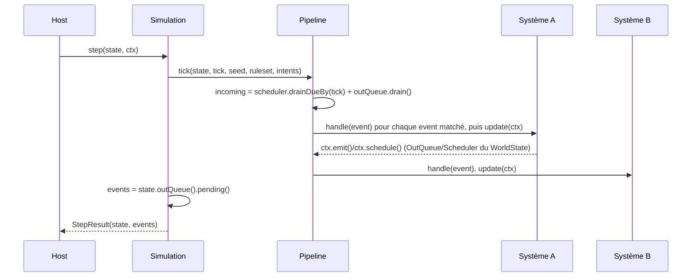
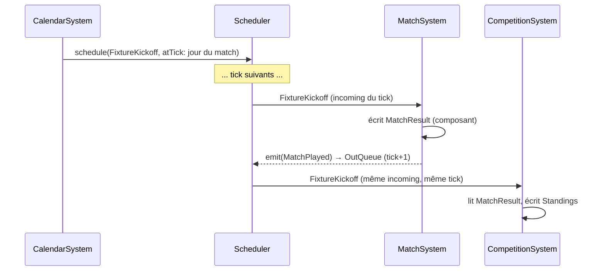

# `flair/kernel`

Le noyau de simulation : une fonction pure et déterministe, sans I/O, qui fait avancer un `WorldState` d'un tick (`docs/11-architecture-generale.md` §1). Zéro dépendance runtime — aucun framework, aucun ORM, aucun accès disque ou réseau.

Ce fichier documente **l'implémentation telle qu'elle existe** : les classes, leur rôle, comment elles s'articulent. `docs/10-16` à la racine du repo restent la référence de conception ("ce qu'on veut construire" — modèle du monde, algorithmes, roadmap) ; en cas de divergence entre ce README et le code, **le code a raison** — ce fichier décrit un instantané, pas une spec.

## Arborescence

```
src/Core/
  Ecs/          entités, composants, l'état du monde
  Messaging/    les trois messages (Fait/DecisionRequest/Intent), les deux files inter-ticks
  Pipeline/     l'exécution d'un tick sur une liste de systèmes
  Support/      PRNG déterministe, arithmétique 32 bits, calendrier simulé
  Ruleset/      règles paramétriques versionnées, imbriquées par sous-domaine
  Simulation/   step() — assemble tout ce qui précède
src/Football/   le domaine football, au-dessus du kernel générique
```

### `Ecs/`

- **`EntityIdAllocator`** — compteur monotone, jamais de réutilisation d'id, `0` réservé comme sentinelle "aucune entité".
- **`ComponentReader<T>`** — vue lecture seule d'une colonne (`get()`/`entities()`). Existe pour que `SystemContext::read()` puisse rendre un handle qui n'a physiquement pas de `set()`.
- **`ComponentStore<T>`** — une colonne par type de composant, implémente `ComponentReader<T>` : `set()`/`get()`/`remove()`, et `entities()` qui renvoie **toujours** les ids triés, jamais l'ordre d'insertion (`docs/12-` §2 — "la source n°1 de non-reproductibilité silencieuse"). Accès complet et non gardé — c'est le stockage brut, que worldgen et le harness écrivent légitimement via `WorldState` sans être des systèmes. Un `System`, lui, n'y touche jamais directement.
- **`WorldState`** — agrège l'allocateur, un `ComponentStore` par type de composant, les singletons (adressés par type via `singleton()`/`setSingleton()`), **et** le `Scheduler`/`OutQueue` du monde. Ces deux derniers ont rejoint `WorldState` précisément parce que `step()` ne prend que `WorldState` + `TickContext` — rien d'autre ne pourrait les faire survivre d'un appel à l'autre (voir `docs/13-` §5, note sur les snapshots).

### `Messaging/`

- **`DomainEvent`/`DecisionRequest`/`Intent`** — trois interfaces marqueurs vides. Jamais confondues : un Fait est passé et journalisé, une `DecisionRequest` est transitoire et jamais journalisée, un `Intent` est un futur immédiat consommé une fois. `TaxonomyTest` encode cette non-confusion en assertion exécutable.
- **`Scheduler`/`ScheduledEntry`** — file d'événements datés. `schedule($event, $atTick, $systemIndex, $entityId, $seq)`, `drainDueBy($tick)` retire et renvoie tout ce qui est échu, trié `(tick, systemIndex, entityId, seq)` — jamais l'ordre d'un tas binaire.
- **`OutQueue`/`OutQueueEntry`** — canal par défaut entre deux ticks. `emit()` écrit, `drain()` vide et renvoie trié `(systemIndex, entityId, seq)` — c'est ce retour qui devient l'`$incoming` du tick suivant. `pending()` fait la même lecture triée **sans vider** la file : sert à capturer ce qui vient d'être émis pendant le tick courant (voir `Simulation::step()` plus bas).

### `Pipeline/`

- **`System`** (interface) — `id()`, `reads()`/`writes()`/`removes()`/`creates()`, `subscribesTo()` (types d'événements écoutés), `handle(DomainEvent, SystemContext)`, `update(SystemContext)`. Les quatre verbes d'accès aux composants sont distincts parce qu'ils portent des contraintes différentes :

  | Verbe | Opération | Contrainte |
  |---|---|---|
  | `reads()` | `read()` → `get()`/`entities()` | ne doit pas lire un composant écrit ou retiré **plus loin** dans le pipeline |
  | `writes()` | `write()` → `set()` sur n'importe quelle entité | **un seul writer** par composant |
  | `removes()` | `write()` → `remove()` (retrait d'archétype) | **un seul remover** par composant |
  | `creates()` | `write()` → `set()` sur une entité créée par ce système dans ce tick | **un seul créateur** par composant |

  Séparer `creates()` de `writes()` répond au même besoin qui avait déjà séparé `removes()` : un writer de valeur et un créateur d'entité peuvent coexister sur un même composant sans se marcher dessus, puisqu'ils ne touchent jamais la même entité. `YouthIntakeSystem` crée les composants de compétences dont `PlayerDevelopmentSystem` est seul writer — les deux cohabitent légitimement. `creates()` est aussi le seul des quatre exclu du contrôle de dépendance inversée : un créateur ne peut pas invalider une lecture déjà faite, puisque l'entité n'existait pas quand le lecteur a itéré.

  **Ces quatre déclarations sont opposables, pas documentaires** : `SystemContext` refuse tout accès non déclaré (`UndeclaredAccessException`), et la restriction de `creates()` à « une entité créée par ce système dans ce tick » est elle-même vérifiée, via le registre `CreatedEntities` que `createEntity()` alimente. C'était nécessaire parce que `Football\PipelineInvariantsTest` ne compare que des déclarations *entre elles* — il ne peut structurellement pas voir un accès non déclaré, donc rien n'empêchait une déclaration de mentir.
- **`SystemContext`** — façade unique par laquelle un système accède à tout. L'accès au monde est scindé en deux handles dont le **type porte la permission** : `read(T)` renvoie un `ComponentReader<T>` (`get()`/`entities()`, et physiquement pas de `set()` — PHPStan attrape donc l'erreur à l'analyse), `write(T)` un `GuardedComponentWriter<T>` (`set()`/`remove()`, gardés selon la déclaration exacte). Ce dernier n'expose volontairement pas `get()` : lire passe obligatoirement par `read()`, sinon `reads()` redeviendrait décoratif. Les deux ne sont **pas** une paire symétrique, et ne vivent pas au même endroit pour cette raison — `ComponentReader` est une *capacité* de l'ECS (`ComponentStore` l'implémente), le second un *garde* qui porte les droits d'un système sur un tick et dépend donc de `SystemAccess`/`CreatedEntities`/`UndeclaredAccessException`. Le mettre dans `Ecs` y ferait importer `Pipeline` et inverserait la seule stratification du noyau. `createEntity()`/`singleton()`/`setSingleton()` délèguent au `WorldState` sous la même garde (un singleton se déclare comme un composant : `MonetaryMass` figure dans les `reads()`/`writes()` de `FinanceSystem`) ; `schedule()`/`emit()` délèguent au `Scheduler`/`OutQueue` en fournissant `systemIndex`/`seq` ; `rng(entityId)` délègue à `Rng::forStream` ; `ruleset()`/`intents()` exposent ce que le `TickContext` a fourni.
- **`SystemAccess`** — les quatre déclarations d'un système, indexées pour un test O(1) et construites une seule fois dans le constructeur de `Pipeline`. Porte aussi `systemId`, dont `SystemContext` dérive le flux RNG.
- **`SeqCounter`** — compteur monotone d'émission, une instance par tick, partagée par tous les `SystemContext` de ce tick (garantit l'ordre total même quand deux systèmes émettent avec le même `systemIndex`).
- **`Pipeline`** — construit avec une `list<System>` **déclarée et ordonnée** (l'ordre est une donnée d'architecture versionnée avec le noyau, pas un détail). `tick(WorldState, tick, worldSeed, Ruleset, intents)` calcule l'`$incoming` une seule fois (`Scheduler::drainDueBy()` + `OutQueue::drain()`, concaténés — deux lots distincts, pas de tri unifié entre les deux), puis pour chaque système dans l'ordre déclaré : traite les événements de `$incoming` qui matchent `subscribesTo()` via `handle()`, puis appelle `update()`.

### `Support/`

- **`Math32::mul32(a, b)`** — multiplication 32×32→32 bits, par blocs de 16 bits. Seul point de vérité pour un piège précis : PHP fait basculer silencieusement un dépassement d'`int` en `float`, sans erreur — une multiplication naïve `(a * b) & 0xFFFFFFFF` peut déjà avoir perdu en float avant que le masque ne s'applique.
- **`Hash::mix32(worldSeed, tick, systemIdHash, entityId)`** — dérive une graine 32 bits à partir des 4 clés d'un flux. XOR-fold séquentiel + avalanche murmur3 entre chaque étape.
- **`Rng`** — PRNG xoshiro128\*\*, 32 bits, masqué partout. `Rng::forStream($worldSeed, $tick, $systemId, $entityId)` est le constructeur nommé à utiliser en pratique (voir Déterminisme ci-dessous) ; le constructeur nu `new Rng($seed)` reste utilisable directement (c'est ce que fait `forStream` en interne).
- **`SimDate`** — le seul temps connu du noyau (`docs/13-` §1 : "1 tick = 1 jour simulé"). Wrapper minimal autour d'un compteur de jours (`epochDay`), `yearsSince()` pour les écarts. `$ctx->tick` est directement utilisable comme `epochDay` : pas besoin d'un `WorldClock`/epoch réel tant que seule la différence entre deux dates compte.

### `Ruleset/`

Structure imbriquée par sous-domaine (`docs/12-` §6 : `competitions`, `transferWindows`, `contracts`, `finance`, `balance`), pas une liste plate de scalaires — pensée pour rester lisible au fur et à mesure que le nombre de champs grandit.

- **`Ruleset`** — la racine : `version`, et une propriété nommée par groupe (`balance` aujourd'hui). Chaque futur groupe suit le même pattern : une classe dédiée dans ce même namespace, une propriété avec une valeur par défaut sur `Ruleset` — jamais un sac générique/associatif.
- **`Balance`** — les leviers d'équilibrage. Deux multiplicateurs globaux (`developmentRate`, `trainingRate`), et une classe dédiée par système pour les leviers plus fins : `RetirementBalance`, `PlayerDevelopmentBalance`, `YouthIntakeBalance`. Une classe par système plutôt qu'un sac partagé, pour qu'un système ne dépende jamais des leviers d'un autre — même principe que `reads()`/`writes()`. `injuryBaseHazard`/`marketInflationTarget` (`12-` §6) rejoindront cette classe quand un système les lira réellement.

Famille à part entière plutôt qu'un fichier isolé à la racine de `Core/` : ni `Pipeline` ni `Simulation` ne doivent dépendre l'un de l'autre pour ce type, et les deux en ont besoin — même raisonnement qu'avant, la famille grandit simplement au même titre que `Pipeline`/`Simulation`.

### `Simulation/`

- **`TickContext`** — readonly : `tick`, `seed`, `intents` (`list<Intent>`), `ruleset`. Les entrées d'un tick, façon `11-` §1.
- **`StepResult`** — readonly : `state` (le `WorldState`, muté en place), `events` (`list<DomainEvent>`, ce qui a été émis *pendant* ce tick).
- **`Simulation::step(WorldState $state, TickContext $ctx): StepResult`** — la fonction pure documentée. Implémentation complète :

  ```php
  public function step(WorldState $state, TickContext $ctx): StepResult
  {
      $this->pipeline->tick($state, $ctx->tick, $ctx->seed, $ctx->ruleset, $ctx->intents);

      return new StepResult($state, $state->outQueue()->pending());
  }
  ```

## Le tick, de bout en bout



Points structurants :

- **`$incoming` est figé avant qu'aucun système ne s'exécute.** Ce qu'un système émet pendant le tick part dans `OutQueue`/`Scheduler`, jamais dans `$incoming` — une boucle infinie intra-tick est donc **structurellement** impossible, pas juste évitée par convention (`docs/16-` §3).
- **Un événement émis ce tick est traité au tick suivant, jamais celui-ci.** `PipelineTest::testAnEventEmittedDuringThisTickIsNeverHandledInTheSameTick` verrouille ce comportement.
- **`StepResult.events` ne contient que les `emit()` de ce tick**, pas les événements déjà traités (`$incoming`), et rien du `Scheduler` : un événement seulement planifié n'est pas encore un Fait tant qu'il n'a pas été déclenché.
- **L'ordre de souscription = l'ordre du pipeline.** Si deux systèmes écoutent le même type d'événement, ils le traitent dans l'ordre déclaré à la construction de `Pipeline`, jamais dans un ordre d'enregistrement de handlers.

## Déterminisme en pratique

Un système qui a besoin d'aléatoire ne crée **jamais** de PRNG lui-même : il appelle `$ctx->rng($entityId)`.

```php
$rng = $ctx->rng(entityId: $playerId);
$roll = $rng->nextUint32();
```

Ça délègue à `Rng::forStream($worldSeed, $tick, $systemId, $entityId)`, qui dérive la graine via `Hash::mix32(...)`. Conséquence directe : deux systèmes différents, ou la même entité à deux ticks différents, tirent dans des flux totalement isolés — jamais un PRNG global partagé. Ajouter un système ou en réordonner un autre ne décale le tirage d'aucun flux existant.

Trois vecteurs de régression figent ce comportement : `RngTest::testRegressionVectorForSeed42` (cross-vérifié contre une implémentation Python indépendante), `HashTest::testRegressionVector` et `RngTest::testForStreamRegressionVector` (internes, pas cross-vérifiés — `Hash::mix32` n'est pas un algorithme publié).

## Écrire un `System` — exemple minimal

```php
final readonly class Fatigue
{
    public function __construct(public int $value) {}
}

final class FatigueRecovered implements DomainEvent {}

final class FatigueRecoverySystem implements System
{
    public function id(): string { return 'fatigue-recovery'; }
    public function reads(): array { return [Fatigue::class]; }
    public function writes(): array { return [Fatigue::class]; }
    public function removes(): array { return []; }
    public function creates(): array { return []; }
    public function subscribesTo(): array { return []; } // purement periodique

    public function handle(DomainEvent $event, SystemContext $ctx): void {}

    public function update(SystemContext $ctx): void
    {
        foreach ($ctx->read(Fatigue::class)->entities() as $entityId) {
            $fatigue = $ctx->read(Fatigue::class)->get($entityId);
            $recovery = $ctx->rng($entityId)->nextUint32() % 3; // 0-2 points recuperes

            $next = max(0, $fatigue->value - $recovery);
            // write() exigerait Fatigue dans writes()/creates()/removes() : la
            // declaration ci-dessus n'est pas decorative, elle est opposee.
            $ctx->write(Fatigue::class)->set($entityId, new Fatigue($next));

            if ($next === 0 && $fatigue->value > 0) {
                $ctx->emit(new FatigueRecovered(), entityId: $entityId);
            }
        }
    }
}
```

Points à retenir de cet exemple :
- Les composants sont **readonly** : on ne modifie jamais en place, on écrit un nouveau composant via `set()`.
- L'itération se fait via `entities()`, toujours triée par id — jamais un `foreach` sur un tableau associatif construit ailleurs.
- Un fait n'est émis que s'il franchit un seuil comportemental (`docs/16-` §2) — ici, "la fatigue vient de tomber à zéro", pas "la fatigue a changé".

## `Ruleset` et `TickContext.intents`

`Ruleset` a son premier vrai consommateur : `Football\PlayerDevelopmentSystem` lit `ruleset()->balance->developmentRate` pour moduler la vitesse de progression naturelle, `Football\TrainingSystem` lit `ruleset()->balance->trainingRate` pour calibrer la qualité d'entraînement (voir « Le domaine football » ci-dessous). `TickContext.intents` reste de la plomberie sans consommateur — rien dans le domaine football n'a encore besoin de traiter une intention humaine/PNJ.

## Le domaine football (`src/Football/`)

Premier code hors du kernel générique : le vieillissement, le plus autonome des cinq systèmes de la Phase 0 (`docs/15-` §4 — pas besoin de calendrier ni de moteur de match), scindé en deux systèmes à responsabilité unique plutôt qu'un seul `AgingSystem` — la retraite (retrait d'archétype, irréversible) et la progression des compétences (mutation de valeur) n'ont pas la même forme, et ne doivent jamais avoir deux writers sur les mêmes composants (voir « Un système déclare `reads()`/`writes()`/`removes()` » ci-dessous).

- **`Person`** — identité minimale (`name`, `birthDate: SimDate`). Persiste à travers les changements de rôle (`docs/12-` §1).
- **`PlayerPhysicalSkills`/`PlayerTechnicalSkills`/`PlayerMentalSkills`** — les attributs de champ de `docs/12-` §5, regroupés par comportement de vieillissement plutôt que par domaine métier, readonly.
- **`PlayerPotentials`** — `ceiling`/`*PeakAge` (un par catégorie)/`growthRate`/`fragility` (`docs/14-` §2) : une trajectoire souple, pas un plafond dur.
- **`TrainingEffect`** — la qualité d'environnement d'entraînement d'un joueur, `h(entraînement)` uniquement (`docs/14-` §2 : `modif = clamp(h × i(temps de jeu) × j(moral), 0.5, 2.0)`, pas le produit complet) : un multiplicateur `[0.5, 2.0]` déjà borné par son producteur (`TrainingSystem`), lu par `PlayerDevelopmentSystem` avec un défaut neutre (1.0) quand absent (joueur sans club). `i`/`j` seront, le jour où `MatchSystem`/`Morale` existeront, des composants-facteurs **séparés** — jamais fusionnés ici (un seul writer par composant).
- **`Club`** — identité minimale (`name`) sur une entité club, réduite face au catalogue complet de `docs/12-` §3 (pas de `Squad`/`Reputation`/`FanBase`/`BoardExpectations`, pas de worldgen — clubs créés à la main). `Finances` a rejoint le modèle en Phase 2, sur l'entité club mais comme composant distinct (voir « Économie » plus bas).
- **`Facilities`** — qualité des installations d'un club, sur l'entité club, exprimée directement sur l'échelle `[0.5, 2.0]` du multiplicateur final. Semée au genesis, puis **écrite par `FacilitiesSystem`** (voir « Économie » plus bas). Ses bornes sont deux constantes du composant et non des leviers de `Ruleset` : deux systèmes doivent les consulter, et un système ne lit jamais les leviers d'un autre. **Piège à connaître** : ce composant a deux lecteurs aux effets très différents — `TrainingSystem` en tire le multiplicateur de progression, `YouthIntakeSystem` en module la *taille des promotions*. La qualité moyenne du monde pilote donc directement la stationnarité de la population.
- **`SquadMembership`** — affectation d'un joueur à un club (`clubId`), sur l'entité **joueur**. Pas de composant `Squad` réciproque côté club dans ce lot.
- **`PlayerRetired`** / **`YouthPlayerPromoted`** — les deux Faits du cycle de vie d'un joueur, symétriques : la sortie de la population (irréversible, `docs/16-` §2) et l'entrée dedans (racontable). La dérive quotidienne des attributs, elle, ne franchit aucun seuil décisionnel et n'émet rien.
- **`Generation/PlayerFactory`** + **`Generation/PlayerBlueprint`** — la loi de talent du monde, en un seul endroit. `drawPotentials()` tire un `PlayerPotentials`, `drawRookie()` un `PlayerBlueprint` complet (les 5 composants d'un joueur neuf). **Pure** : aucun accès au monde, l'appelant écrit lui-même — c'est ce qui permet à `YouthIntakeSystem` (via `SystemContext`) et au harness (via `WorldState`) de partager la factory alors qu'ils n'ont aucun type d'accès commun. Ce partage n'est pas cosmétique : si la population initiale et les promotions annuelles suivaient deux lois de talent différentes, le monde convergerait mécaniquement vers celle de l'intake et la pyramide des âges ne pourrait pas être stationnaire.

  Le `ceiling` suit une **Beta(1, k)** (`min` de `k` uniformes) : beaucoup de joueurs ordinaires, une longue queue de rares talents. `docs/12-` §7 demande une log-normale ; on lui substitue cette loi parce qu'une vraie log-normale exige `exp`/`log`/`sqrt`/`cos` (Box-Muller), qui viennent de la libm et peuvent différer d'un ulp d'une plateforme à l'autre — contrairement à `+`/`-`/`*`/`/`, exacts au bit près en IEEE 754. **Le noyau n'utilise à ce jour aucune fonction transcendante**, et c'est une propriété du déterminisme à ne pas casser par inadvertance. Si la Phase 1 montre que la forme exacte de la queue compte, la remplacer par une table de quantiles interpolée linéairement — pas par Box-Muller.
- **`YouthIntakeSystem`** — purement périodique. **Ferme la boucle démographique** : sans lui, `RetirementSystem` ne fait que vider la population, et le premier critère de sortie de la Phase 0 ("pyramide des âges stationnaire sur 20 saisons", `docs/15-` §4) est structurellement inatteignable. Un jour précis de l'année simulée (`tick % 365 === intakeDayOfYear`), chaque club promeut ~1 à 3 joueurs neufs de 17 ans dans son effectif, en nombre arrondi **stochastiquement** (l'espérance reste exacte malgré des cohortes entières — un `round()` sec écraserait la calibration). Seul système qui `creates()` des joueurs à l'exécution.

  **Le vivier national est de taille fixe.** Un club promeut `baseIntakePerClub × quality / moyenne_du_monde` : les bonnes installations captent une plus grosse **part** du vivier, elles ne l'agrandissent pas. Ce n'est pas une subtilité d'équilibrage — c'est ce qui empêche le monde d'osciller. La modulation directe par `Facilities` était inoffensive tant que la qualité était une constante par club ; depuis que `FacilitiesSystem` la rend dynamique, elle refermerait la boucle `installations → jeunes → effectif → masse salariale → argent → installations`, dont le retour porte le **délai d'une carrière** (~15 ans). Une contre-réaction retardée de ce gain oscille : mesuré, la population balançait entre 224 et 381 sur 60 saisons, et deux calibrages successifs n'en ont changé que l'amplitude, jamais l'existence. Avec la normalisation, la population reste à 310-323 de l'année 20 à 60 et la qualité moyenne se cale d'elle-même sur 1.009, sans recalibrage. Se défend aussi dans la fiction : le nombre de jeunes talentueux d'un pays tient à sa démographie, pas à la générosité de ses clubs — ceux-ci se disputent lesquels percent.

  Trois choix de conception qui méritent d'être compris avant d'y toucher :
  - **Par club, pas par monde.** Le flux RNG est dérivé de `(worldSeed, tick, systemId, entityId)` — or le système crée des entités qui n'ont pas encore d'identifiant. La clé ne peut donc pas être le joueur produit : c'est le club producteur. Ce qui tombe juste côté domaine, et permet la modulation par `Facilities`.
  - **Aucun régulateur de population.** L'alternative — un intake asservi à une cible — *garantirait* la stationnarité par construction : on mesurerait son propre thermostat, et le critère de sortie de la Phase 0 serait vide de sens. La stationnarité doit rester une propriété **émergente**. (`bin/demo.php` la montre : 4 joueurs au départ, palier à ~48 dès la 30ᵉ année, cohérent avec ~2,9 promus/an × ~16 ans de carrière.)
  - **"Entre dans la population professionnelle", pas "entre au centre de formation".** Un vrai centre accueille 8-12 jeunes par promotion ; les modéliser ferait ~180 entrées/an contre ~28 sorties, soit un monde ×5 en quelques saisons, parce que le vrai football compense par une libération massive qu'on ne modélise pas (il faudrait un `PlayerReleased` et un système d'échec). On modélise donc directement les 1-2 qui percent.
- **`TrainingSystem`** — purement périodique, aucun RNG (fonction déterministe, pas de tirage). Seul writer de `TrainingEffect`, ne lit jamais `PlayerPotentials`/les compétences — aveugle à ce qui consomme son résultat, symétrique de `PlayerDevelopmentSystem` qui est aveugle à sa provenance (cause vs mécanisme). Pour chaque joueur affecté à un club (`SquadMembership`) : `clamp(ruleset()->balance->trainingRate × Facilities::$quality, 0.5, 2.0)` écrit dans `TrainingEffect`. Un joueur sans club ne reçoit aucune écriture — le défaut neutre de `PlayerDevelopmentSystem` s'applique tel quel.
- **`RetirementSystem`** — purement périodique, seul système qui `remove()` `PlayerPotentials`+les trois composants de compétences. Chaque tick, pour chaque entité `Person`+`PlayerPotentials` : au-delà d'un âge d'éligibilité, une probabilité de retraite croissante (âge, `fragility`) est tirée ; si elle tombe, les composants sont retirés et `PlayerRetired` est émis.
- **`PlayerDevelopmentSystem`** — purement périodique, seul système qui `set()` les trois composants de compétences. Chaque attribut progresse ou décline via un taux annuel (`growthRate × écart au plafond × g(âge)`, `balance->developmentRate` du `Ruleset` en multiplicateur, modulé par `TrainingEffect->quality`) converti en probabilité **quotidienne** d'un pas de ±1 — nécessaire pour éviter qu'un taux journalier fractionnaire ne s'arrondisse toujours à zéro, et ça donne une progression par à-coups plutôt qu'une interpolation lisse. Chaque catégorie a son propre âge de pic et sa propre pente de déclin post-pic (`Ruleset\PlayerDevelopmentBalance`).

### Calendrier, match L0 et classement

Dernière brique de la Phase 0 (`docs/15-` §4) : calendrier, match, classement — livrée comme une seule tranche (un calendrier seul n'a pas de consommateur).

- **`Competition`** — identité minimale (`name`) sur une entité compétition, porte `Standings`. **Une seule compétition en Phase 0** : aucun `CompetitionMembership` côté club n'existe, donc `CalendarSystem` associe tous les `Club::entities()` du monde à chaque `Competition` trouvée — juste tant qu'il n'en existe qu'une.
- **`Fixture`** — un match programmé (`competitionId`/`homeClubId`/`awayClubId`/`matchday`), créé une fois par `CalendarSystem` (`creates()`), jamais modifié ensuite.
- **`MatchResult`** — le score, sur la même entité que `Fixture` mais un composant distinct (seul writer `MatchSystem`) : un système qui ne veut qu'ajouter un score n'a pas besoin de connaître la forme complète de `Fixture`.
- **`Standings`/`StandingsEntry`** — le classement, sur l'entité compétition, seul writer `CompetitionSystem`. `entries` (`array<clubId, StandingsEntry>`) est peuplé **paresseusement** : un club n'y apparaît qu'après son premier match, pour éviter à `CompetitionSystem` de devoir lire `Club::class`.
- **`FixtureKickoff`** (planifié via `Scheduler`), **`SeasonStarted`**, **`MatchPlayed`** (Fait) — les trois événements du lot, tous self-suffisants (mêmes précédent que `YouthPlayerPromoted` : un événement se comprend seul, sans recroiser un composant).
- **`Generation/PoissonMatchEngine`** + **`MatchScore`** — le moteur L0 (`docs/14-` §1, Dixon-Coles) : pure comme `PlayerFactory`, `(Rng, ratings, MatchBalance) → MatchScore`. `λ_home = exp((attackHome − defenseAway) / strengthScale + homeAdvantage)`, `λ_away` symétrique sans l'avantage du terrain ; pmf de Poisson par récurrence (`p(0) = exp(-λ)`, `p(k) = p(k-1) × λ / k`, un seul `exp()` par λ) ; correction de Dixon-Coles `τ(x, y, λ, μ, ρ)` sur les scores 0-0/1-0/0-1/1-1 ; tirage par **grille normalisée + inversion de la fonction de répartition cumulée** (un seul `nextUint32()`), plutôt que par rejet — borné, déterministe, pas de boucle non bornée.

  **`exp()` est la première fonction transcendante du noyau — décision consciente, pas une entorse au paragraphe `PlayerFactory` ci-dessus.** `PlayerFactory` évite `exp`/`log`/`sqrt`/`cos` pour la loi de talent à cause d'un risque de **portabilité cross-plateforme/cross-libc** (un `ulp` de différence changerait la forme de la queue de distribution). Mais `docs/13-` §4.8 précise que le noyau n'a besoin que d'une reproductibilité **même machine, même version de PHP** — pas cross-plateforme, puisque seul le serveur exécute le noyau (pas de lockstep multijoueur). Sur une même machine, `exp()` de la libm rend toujours le même résultat pour les mêmes entrées : le déterminisme n'est donc pas menacé ici, et le monde tourne aujourd'hui sur une seule machine. À revisiter si la Phase 1 introduit une comparaison de hash entre machines différentes (harness sur CI, monde en prod sur un autre hôte).
- **`CalendarSystem`** — périodique, `creates() = [Fixture::class]`. À `tick % 365 === seasonStartDayOfYear`, génère pour chaque `Competition` un calendrier aller-retour complet par la **méthode du cercle** (déterministe, aucun RNG), crée une `Fixture` par match et programme un `FixtureKickoff` via `ctx->schedule()`. Programme aussi le `SeasonEnded` de la saison qu'il vient de générer, au **lendemain** de sa dernière journée : c'est lui qui connaît les dates, personne d'autre. Le « lendemain » n'est pas cosmétique — au tick de la dernière journée, `CompetitionSystem` traite encore les coups d'envoi du jour et le classement n'est complet qu'à la fin de ce tick. Invariant testable indépendamment du détail d'alternance de la méthode : chaque club joue exactement `N-1` fois à domicile et `N-1` fois à l'extérieur sur la saison (la manche retour est la manche aller, domicile/extérieur inversés).
- **`MatchSystem`** — réactif sur `FixtureKickoff`, `writes() = [MatchResult::class]`. Calcule un rating attaque/défense par club à partir de l'effectif (`SquadMembership` + skills) — pas de `Position` ni de sélection d'onze (`docs/15-` déjà arrêté) : `attackRating` moyenne `finishing`/`passing`/`technique`/`pace`, `defenseRating` moyenne `defending`/`positioning`/`strength`/`reflexes` sur tout l'effectif. Club sans joueur → rating neutre (50.0). Écrit `MatchResult` **et** émet le Fait `MatchPlayed`.
- **`CompetitionSystem`** — réactif sur `FixtureKickoff`, `SeasonEnded` et `SeasonStarted`, `writes() = [Standings::class]`. Sur `FixtureKickoff` : lit `MatchResult`. Sur `SeasonEnded` : émet `SeasonConcluded` avec le classement final, **sans** toucher la table (elle doit survivre jusqu'à la saison suivante, le harness va l'y lire). Sur `SeasonStarted` : remet `Standings` à vide. C'est le seul endroit du noyau qui sait ce que « premier » veut dire : points, différence de buts, buts marqués, puis `clubId` croissant — ce dernier départage n'est pas cosmétique, il rend le comparateur **total** et donc le classement indépendant de l'ordre d'insertion de `Standings::$entries`, qui est un ordre de Map interdit comme source d'ordre (`docs/12-` §2).

  **Le point d'architecture à retenir : `MatchSystem` et `CompetitionSystem` réagissent au même `FixtureKickoff`.** `Pipeline::tick()` calcule `$incoming` une seule fois puis le rejoue pour chaque système dans l'ordre déclaré (voir "Le tick, de bout en bout" plus haut) — `MatchSystem`, déclaré avant, a donc déjà écrit `MatchResult` quand `CompetitionSystem` traite le même événement. C'est exactement l'exemple documenté par `docs/13-` §2 : *"un match joué doit alimenter le classement du jour"* — canal 1 (composant lu le jour même), pas canal 2 (`MatchPlayed`, qui n'arriverait qu'au tick suivant et serait trop tard pour le classement du jour).



Pipeline déclaré (`bin/demo.php`, `Harness\Simulation\PipelineFactory`, `Football\PipelineInvariantsTest`) : `FacilitiesSystem`, `YouthIntakeSystem`, `TrainingSystem`, `RetirementSystem`, `FinanceSystem`, `PlayerDevelopmentSystem`, `CalendarSystem`, `MatchSystem`, `CompetitionSystem` — `FacilitiesSystem` en tête (ses deux lecteurs ouvrent le pipeline), les facteurs avant les effets (`TrainingSystem` avant `PlayerDevelopmentSystem`), `YouthIntakeSystem` en tête (canal 1 pour les joueurs promus), `FinanceSystem` après `RetirementSystem` (il lit `Contract`, que la retraite retire), puis le trio calendrier/match/classement en fin de pipeline (`MatchSystem` avant `CompetitionSystem`, obligatoire pour le canal 1 ci-dessus).

Simplifications assumées (voir les docblocks des classes pour le détail) : `ceiling`/`growthRate`/`fragility` partagés entre les trois catégories plutôt qu'un plafond par attribut, pas de "queue épaisse" sur le bruit, pas de potentiel révélé progressivement (dépend du comptage de matchs, donc du moteur de match), domaine `Club` réduit à l'identité + une qualité scalaire, une seule compétition (pas de `CompetitionMembership`), force de club = agrégat de tout l'effectif (pas de `Position`). Premier jet à calibrer via le harness d'équilibrage (Phase 1), pas des valeurs équilibrées.

### Économie : grand livre monétaire et répartition des revenus

Première brique de la Phase 2 (`docs/15-` §4). Une injection (l'enveloppe des droits TV) et un puits (les salaires), sans RNG : tout ce qui différencie deux clubs vient de leur classement.

- **`Finances`** — le solde d'un club, en **centimes entiers** (jamais un float : l'invariant de conservation s'assert à la centime près sur des millions d'opérations, ce qui serait invérifiable en virgule flottante). Semé au genesis par le harness, jamais créé par un système. Un solde négatif est possible et n'est pas un bug : l'invariant porte sur la conservation globale, pas sur la solvabilité par club.
- **`Contract`** — l'engagement salarial d'un joueur (`clubId`, `wagePerWeekCents`, `expiresOn`), sur l'entité **joueur**, même forme que `SquadMembership`. Toujours pas de `releaseClause`/`agentId` : rien ne les consommerait (ni négociation, ni agents). Créé par `YouthIntakeSystem`, écrit et retiré par `SquadSystem`.
- **`SeasonIncome`** — la part de l'enveloppe versée à un club pour la saison en cours. Un **flux**, là où `Finances` est un **stock** — et c'est le flux qui porte le « Gini des revenus » de `docs/14-` §7. Le stock ne peut pas servir à ce calcul : il mêle revenus et salaires et dérive vers le négatif au calibrage actuel, or un Gini sur des valeurs négatives n'a pas de sens.
- **`Singletons/MonetaryMass`** — premier singleton du domaine football : `Σ injections` et `Σ puits` courants (`docs/14-` §6). Mis à jour dans la même boucle que chaque écriture de `Finances`, **jamais recalculé indépendamment** — c'est ce qui permet au test de conservation du harness de détecter une divergence réelle plutôt que de rejouer sa propre copie de la logique métier.
- **`SeasonEnded`** puis **`SeasonConcluded`** — la fin de saison en deux temps, parce qu'aucun système ne détient les deux moitiés de l'information. `CalendarSystem` sait **quand** une saison finit (il a planifié toutes ses journées) mais ne peut pas lire `Standings` ; `CompetitionSystem` détient le classement mais ignore le calendrier. Le premier programme donc un marqueur nu (`SeasonEnded`), le second le traduit en Fait porteur du classement final (`SeasonConcluded`, `list<clubId>`).

  **La première version émettait `SeasonConcluded` au démarrage de la saison suivante** — le seul moment où le noyau savait qu'une saison était finie, faute de signal de fin. Ça sacrait le champion 120 jours après son dernier match (18 clubs : 34 journées, dernière au jour 245 d'une saison de 365). Sans conséquence tant que seul `FinanceSystem` écoutait, mais l'event log est ce que la Phase 3 persiste et la Phase 4 rejoue : la date fausse s'y serait gravée, et le digest de retour d'absence (`docs/14-` §9) aurait annoncé un champion quatre mois trop tard.
- **`FinanceSystem`** — réactif sur `SeasonConcluded` (répartition des revenus), périodique sur `tick % 7 === wagePaymentDayOfWeek` (salaires). Un seul système pour les deux mouvements : ils ont la même forme (ajuster un solde), et deux systèmes qui écriraient tous les deux `Finances` violeraient l'invariant « un seul writer par composant ».

  **Pourquoi le classement voyage dans l'événement plutôt que d'être relu.** `FinanceSystem` ne peut pas lire `Standings` : son writer `CompetitionSystem` est placé **plus loin** dans le pipeline, et `PipelineInvariantsTest` interdit toute lecture d'un composant écrit plus loin (dépendance inversée). Déplacer `FinanceSystem` après `CompetitionSystem` le ferait lire une table fraîchement vidée. Le classement passe donc par le payload — ce qui a l'avantage collatéral de rendre le système indifférent à la forme de `Standings`.

  **La répartition** (`docs/14-` §7, « partage des droits TV » comme levier d'équilibre compétitif) : l'enveloppe totale vaut `clubIncomePerSeasonCents × nombre de clubs` et ne dépend **pas** du classement — seule sa répartition en dépend.

  ```
  meritPool   = round(pot × meritShare)
  equalPool   = pot − meritPool          (somme exacte, aucune dérive)
  poids(rang) = N − rang                 (rang 0-indexé : 1er → N, dernier → 1)
  part(club)  = equalPool/N + meritPool × poids / (N(N+1)/2)
  ```

  Trois détails qui comptent : le **reste des divisions entières n'est pas injecté** (`pot` est un plafond, et `MonetaryMass` comptabilise les montants *réellement* crédités — c'est ce qui garde l'invariant vrai par construction) ; un **classement vide annule la part au mérite** quel que soit `meritShare`, sinon le plus petit `EntityId` du monde toucherait plusieurs fois le revenu du plus grand à la genèse, une hiérarchie arbitraire gravée à la création ; `meritShare` vaut **0.0 par défaut**, ce qui reproduit exactement le comportement plat d'avant ce levier — le monde par défaut reste bit-identique et l'effet du mérite se mesure d'abord au harness (`--set meritShare=…`) avant de devenir un défaut.

  **Le seul Fait émis est l'investissement.** Un versement de salaire, un crédit de saison ou un débit d'entretien sont de la comptabilité de routine : ni seuil comportemental franchi, ni irréversible, ni racontable (`docs/16-` §2). Émettre un Fait par joueur et par semaine reproduirait le piège des « 3 millions d'événements de bruit par saison » (`docs/15-` §5). Agrandir son centre de formation, en revanche, franchit un seuil et se raconte — au plus un par club et par saison.

- **`ClubInvestedInFacilities`** puis **`FacilitiesSystem`** — la boucle de `docs/14-` §7 refermée : `résultats → revenus → installations → (entraînement + taille des promotions) → compétences → résultats`.

  **Le passage par un événement n'est pas un choix de style, c'est la seule option.** `Facilities` est lu par `YouthIntakeSystem` et `TrainingSystem`, en tête de pipeline : son writer doit venir avant eux. `Finances` est écrit par `FinanceSystem` : tout lecteur doit venir après lui. Aucun ordre ne satisfait les deux — `YouthIntakeSystem` doit rester en tête pour le canal 1 des joueurs promus. Un système unique qui lirait l'argent et écrirait les installations est donc structurellement impossible. Même mur, même réponse, que `SeasonConcluded`.

  `FacilitiesSystem` ouvre le pipeline et est le seul writer de `Facilities`. Sur `SeasonConcluded` la qualité se dégrade ; sur `ClubInvestedInFacilities` l'argent dépensé la relève. Les deux mouvements dans le même système, parce que deux writers sur un composant sont interdits — même raisonnement que la réunion des revenus et des salaires dans `FinanceSystem`.

  **Dégradation inconditionnelle**, pas « seulement si le club est dans le rouge » : la règle binaire créerait une falaise où tous les clubs s'effondrent ensemble, là où une dérive constante que l'investissement compense donne un équilibre continu, fonction directe des revenus du club. C'est le rendement décroissant que `docs/14-` §7 demande. L'entretien, qui croît avec le **carré** de la qualité (`FinanceSystem::chargeUpkeep`, pas linéairement), joue le même rôle en plus marqué : il mord bien avant la borne haute du composant, et de plus en plus fort à mesure qu'on s'en approche — c'est l'amortisseur de la boucle « résultats → argent → meilleurs joueurs → résultats » (`docs/14-` §7), retenu plutôt qu'un mécanisme endogène type conseil d'administration/limogeage, hors périmètre de la Phase 2 (pas de gouvernance de club).

- **`Core/Support/SimDate`** — le seul temps connu du noyau (`docs/13-` §1, "1 tick = 1 jour simulé") : un compteur de jours, `yearsSince()` pour les écarts. Générique, pas spécifique football — c'est lui que porte `Contract.expiresOn`.

### Contrats : expiration, renouvellement, joueurs sans club

Deuxième brique de la Phase 2. Elle pose ce qui manquait pour qu'un marché ait une *raison* d'exister : **le contrat a une fin**. Un jour par an (`renewalDayOfYear`, le même que l'arrivée des jeunes), les contrats arrivés à terme sont renouvelés, ou pas, et les joueurs libérés changent de club.

Vocabulaire : un joueur sans contrat est dit **sans club**, jamais « agent libre » — dans ce projet « agent » désigne déjà l'intermédiaire qui représente les joueurs (`docs/14-` §5), c'est-à-dire le rôle incarné par le joueur humain.

- **`Support/WageModel`** — le premier vrai **prix** du monde : `salaire = base × clamp(qualité / référence, 0.4, 2.5)`, forme bornée de `docs/14-` §3, jamais une composition libre de facteurs. Le clamp n'est pas un garde-fou défensif : il fixe l'écart de salaire maximal entre le pire et le meilleur joueur, donc l'amplitude de l'inégalité économique que le monde peut produire. Deux consommateurs réels (`ContractSystem` et le genesis du harness), ce qui est le seul critère que le projet s'applique pour extraire une classe partagée. Le contrat d'une recrue reste au **forfait** : un premier contrat d'académie est standardisé, et c'est ce qui donne son intérêt économique au centre de formation — quelques années de talent payé sous sa valeur.

- **`ContractSystem` (décision, en queue de pipeline) + `SquadSystem` (application, en tête)** — le découpage est **structurellement forcé**, pas un choix de style. Décider un renouvellement demande de lire les compétences (écrites par `PlayerDevelopmentSystem`, retirées par `RetirementSystem`) et `Finances` (écrit par `FinanceSystem`) : le décideur doit venir **après** eux. Écrire `SquadMembership` impose de venir **avant** `TrainingSystem` et `MatchSystem`, qui le lisent. Aucun ordre de pipeline ne satisfait les deux — d'où décider tard, émettre un Fait, appliquer tôt au tick suivant. Même mur, même réponse, que `ClubInvestedInFacilities`.

  `SquadSystem` devient seul writer et seul remover de `Contract` **et** `SquadMembership`, y compris sur `PlayerRetired` : `RetirementSystem` ne possède plus que l'archétype « joueur » (compétences et potentiels). La frontière est nette et tiendra quand des rôles non-joueurs existeront — un entraîneur aussi a un employeur. Elle corrige au passage la limite qui traînait : un retraité conservait indéfiniment son `SquadMembership`.

- **`ContractSigned` / `ContractExpired`** — `ContractSigned` couvre renouvellement, arrivée et transfert d'un seul type (`previousClubId` les distingue). `ContractExpired` n'est émis **que** pour les joueurs que personne n'a repris : un joueur libéré puis re-signé le même jour n'émet que `ContractSigned`, ce qui évite à `SquadSystem` deux Faits contradictoires sur la même entité et divise le volume. Volume annuel ≈ un tiers de l'effectif du monde.

- **Aucun argent ne change de mains.** Pas d'indemnité de transfert, pas de négociation multi-tours, pas de rupture en cours de contrat (`docs/14-` §5 les prévoit tous, marché des transferts = lot suivant). Conséquence voulue : ce lot ne crée ni ne détruit un centime, et `MonetaryConservationTest` reste vert **sans qu'une ligne de comptabilité soit écrite ici**. C'est le meilleur test du lot : s'il rougit, un flux monétaire a été inventé.

- **Le budget est une part de `SeasonIncome`, pas un plancher de trésorerie.** La règle évidente (« garder N centimes en caisse ») ne tient pas aux ordres de grandeur : un club démarre à 100 000 € quand la réserve d'investissement vaut 500 000 €, donc plus personne ne signerait jamais rien. Un budget salarial de club se raisonne en pourcentage du chiffre d'affaires. `SeasonIncome` étant un **composant** écrit plus tôt dans le pipeline, le lire ne viole ni l'ordre des dépendances ni la règle « un système ne dépend jamais des leviers d'un autre » — c'est le résultat qui est lu, pas le levier.

- **L'ordre de service évite une hiérarchie gravée à la création.** Les clubs se servent par tours, triés par déficit d'effectif décroissant, égalités départagées par une **clé de loterie** tirée sur `rng(clubId)` et rejouée chaque année. Trier par `clubId` aurait gravé un avantage permanent que le harness aurait ensuite mesuré comme une vraie inégalité — le piège que `FinanceSystem` documente déjà pour la répartition des revenus.

- **Ce que la mesure dit, et ce qu'elle ne dit pas** (six graines appariées, 40 saisons, 500 joueurs / 18 clubs) : la **rotation du top 5 monte de 47,8 % à 53,3 %, sur 6 graines sur 6** — c'est la propriété anti-sclérose de `docs/14-` §7, et le seul effet consistant du lot. Le **Gini des titres ne bouge pas de façon détectable** (0,528 → 0,557) : l'écart entre configurations est très inférieur à la dispersion entre graines (0,363 à 0,614 sur la seule référence). Toute lecture du Gini sur une graine unique est du bruit — c'est l'erreur commise pendant le développement de ce lot, et corrigée en élargissant l'échantillon.

- **Limite connue, laissée telle quelle.** `MatchSystem` note la **moyenne** des compétences d'un effectif quand le budget en contraint le **total** : concentrer le budget sur peu de bons joueurs est donc légèrement avantageux (14 joueurs à 60,3 de qualité moyenne pour le meilleur club, 18 à 50,8 pour le dernier). Un plancher d'effectif a été essayé pour le corriger et **mesuré comme nuisible** — Gini inchangé, rotation du top 5 retombée à 49,2 % — donc retiré. La vraie correction appartient au moteur de match (ne noter que les onze meilleurs) et demande `PositionAffinity`, hors périmètre.

## Dépendances et invariants

Graphe réel des `use` entre familles (aucun cycle) :

```
Ecs         → Messaging
Pipeline    → Ecs, Messaging, Support, Ruleset (racine)
Simulation  → Ecs, Pipeline
Messaging, Support, Ruleset → (rien)
```

Parmi les sept interdits structurants de `docs/11-` §9, ce que le code garantit aujourd'hui :

| Interdit | Statut |
|---|---|
| Un système n'appelle jamais un autre système | **Garanti par construction** : `SystemContext` n'expose aucune référence vers un `System` ou vers `Pipeline` — un système ne peut physiquement pas en atteindre un autre. |
| Un événement n'est jamais traité dans le tick qui l'a produit | **Garanti par construction** : `$incoming` est calculé avant la boucle sur les systèmes, `emit()`/`schedule()` n'écrivent que dans `OutQueue`/`Scheduler`. |
| Itération toujours triée par `EntityId` | **Garanti par construction** pour `ComponentStore`/`Scheduler`/`OutQueue` (tri à la lecture, jamais d'ordre de `Map`). |
| `rand()`/`mt_rand()`/`time()`/accès disque ou réseau interdits dans le noyau | **Conventionnel** : rien ne l'empêche mécaniquement pour l'instant (pas de règle PHPStan/CI dédiée). |
| Un système déclare `reads()`/`writes()`/`removes()`/`creates()`, pas "le monde entier" | **Vérifié mécaniquement, des deux côtés.** Entre déclarations : `Football\PipelineInvariantsTest` détecte deux systèmes qui écrivent/retirent/créent le même composant, et toute lecture d'un composant écrit/retiré plus loin dans le pipeline déclaré. Contre le code réel : `SystemContext` oppose les déclarations à l'exécution (`UndeclaredAccessException`), et le type de retour de `read()` interdit statiquement l'écriture. Une déclaration ne peut donc plus mentir. Reste que la liste vérifiée par `PipelineInvariantsTest` est maintenue à la main tant qu'aucun registre canonique `Pipeline::SYSTEMS` n'existe. |
| Dépendance de package `kernel → (rien)` | **Vrai aujourd'hui** (`composer.json` du kernel n'a aucune dépendance runtime), mais pas vérifié par `deptrac`/`phparkitect` — outil pas encore en place. |

## Commandes de dev

```bash
cd packages/kernel
vendor/bin/phpunit          # tests
vendor/bin/phpstan analyse  # niveau max (src, tests, bin)
php bin/demo.php            # observer un tick reel : quelques joueurs, plusieurs annees simulees
```

`bin/demo.php` n'est pas le harness d'équilibrage (`packages/harness/`, Phase 1) : juste un point d'entrée rapide pour voir un système tourner sans repasser par la suite de tests. Gagnera des systèmes au même rythme qu'ils seront écrits.

Conventions de test observées dans le code existant, à reproduire :
- **Collaborateurs réels, jamais de mocks** — un test construit un vrai `WorldState`/`Scheduler`/`OutQueue` et vérifie le comportement observable, pas des appels attendus sur un double.
- **Vecteurs de régression figés** pour tout ce qui touche au déterminisme (`Rng`, `Hash`) — toute modification volontaire ou non de l'algorithme se voit immédiatement.
- **Data providers plutôt que des valeurs concrètes en dur** quand PHPStan risque de prouver statiquement qu'une assertion est toujours vraie sur un type déjà connu (voir `TaxonomyTest` : les messages transitent par un provider typé `object`/`class-string` pour que le test reste une vraie vérification runtime, pas un `alreadyNarrowedType`).

## État actuel et prochaine étape

Voir la section « Où en est le projet » de `CLAUDE.md` à la racine du repo pour l'avancement à jour — pas dupliqué ici pour ne pas avoir deux sources de vérité.
