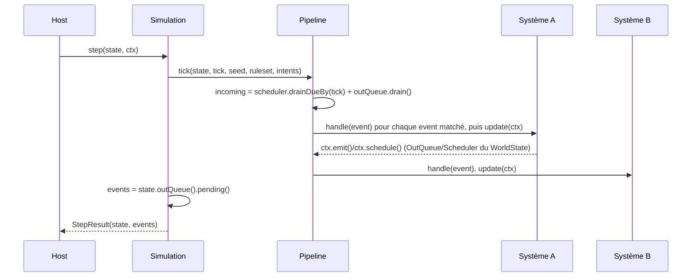

# `flair/kernel`

Le noyau de simulation : une fonction pure et déterministe, sans I/O, qui fait avancer un `WorldState` d'un tick (`docs/11-architecture-generale.md` §1). Zéro dépendance runtime — aucun framework, aucun ORM, aucun accès disque ou réseau.

Ce fichier documente **l'implémentation telle qu'elle existe** : les classes, leur rôle, comment elles s'articulent. `docs/10-16` à la racine du repo restent la référence de conception ("ce qu'on veut construire" — modèle du monde, algorithmes, roadmap) ; en cas de divergence entre ce README et le code, **le code a raison** — ce fichier décrit un instantané, pas une spec.

## Arborescence

```
src/Core/
  Ecs/          entités, composants, l'état du monde
  Messaging/    les trois messages (Fait/DecisionRequest/Intent), les deux files inter-ticks
  Pipeline/     l'exécution d'un tick sur une liste de systèmes
  Support/      PRNG déterministe, arithmétique 32 bits, calendrier simulé
  Ruleset/      règles paramétriques versionnées, imbriquées par sous-domaine
  Simulation/   step() — assemble tout ce qui précède
src/Football/   le domaine football, au-dessus du kernel générique
```

### `Ecs/`

- **`EntityIdAllocator`** — compteur monotone, jamais de réutilisation d'id, `0` réservé comme sentinelle "aucune entité".
- **`ComponentStore<T>`** — une colonne par type de composant : `set()`/`get()`/`remove()`, et `entities()` qui renvoie **toujours** les ids triés, jamais l'ordre d'insertion (`docs/12-` §2 — "la source n°1 de non-reproductibilité silencieuse").
- **`WorldState`** — agrège l'allocateur, un `ComponentStore` par type de composant, les singletons (adressés par type via `singleton()`/`setSingleton()`), **et** le `Scheduler`/`OutQueue` du monde. Ces deux derniers ont rejoint `WorldState` précisément parce que `step()` ne prend que `WorldState` + `TickContext` — rien d'autre ne pourrait les faire survivre d'un appel à l'autre (voir `docs/13-` §5, note sur les snapshots).

### `Messaging/`

- **`DomainEvent`/`DecisionRequest`/`Intent`** — trois interfaces marqueurs vides. Jamais confondues : un Fait est passé et journalisé, une `DecisionRequest` est transitoire et jamais journalisée, un `Intent` est un futur immédiat consommé une fois. `TaxonomyTest` encode cette non-confusion en assertion exécutable.
- **`Scheduler`/`ScheduledEntry`** — file d'événements datés. `schedule($event, $atTick, $systemIndex, $entityId, $seq)`, `drainDueBy($tick)` retire et renvoie tout ce qui est échu, trié `(tick, systemIndex, entityId, seq)` — jamais l'ordre d'un tas binaire.
- **`OutQueue`/`OutQueueEntry`** — canal par défaut entre deux ticks. `emit()` écrit, `drain()` vide et renvoie trié `(systemIndex, entityId, seq)` — c'est ce retour qui devient l'`$incoming` du tick suivant. `pending()` fait la même lecture triée **sans vider** la file : sert à capturer ce qui vient d'être émis pendant le tick courant (voir `Simulation::step()` plus bas).

### `Pipeline/`

- **`System`** (interface) — `id()`, `reads()`/`writes()` (composants déclarés, pas encore vérifiés mécaniquement — voir la section Dépendances), `subscribesTo()` (types d'événements écoutés), `handle(DomainEvent, SystemContext)`, `update(SystemContext)`.
- **`SystemContext`** — façade unique par laquelle un système accède à tout : `components()`/`createEntity()`/`singleton()`/`setSingleton()` délèguent au `WorldState` ; `schedule()`/`emit()` délèguent au `Scheduler`/`OutQueue` en fournissant `systemIndex`/`seq` ; `rng(entityId)` délègue à `Rng::forStream` ; `ruleset()`/`intents()` exposent ce que le `TickContext` a fourni.
- **`SeqCounter`** — compteur monotone d'émission, une instance par tick, partagée par tous les `SystemContext` de ce tick (garantit l'ordre total même quand deux systèmes émettent avec le même `systemIndex`).
- **`Pipeline`** — construit avec une `list<System>` **déclarée et ordonnée** (l'ordre est une donnée d'architecture versionnée avec le noyau, pas un détail). `tick(WorldState, tick, worldSeed, Ruleset, intents)` calcule l'`$incoming` une seule fois (`Scheduler::drainDueBy()` + `OutQueue::drain()`, concaténés — deux lots distincts, pas de tri unifié entre les deux), puis pour chaque système dans l'ordre déclaré : traite les événements de `$incoming` qui matchent `subscribesTo()` via `handle()`, puis appelle `update()`.

### `Support/`

- **`Math32::mul32(a, b)`** — multiplication 32×32→32 bits, par blocs de 16 bits. Seul point de vérité pour un piège précis : PHP fait basculer silencieusement un dépassement d'`int` en `float`, sans erreur — une multiplication naïve `(a * b) & 0xFFFFFFFF` peut déjà avoir perdu en float avant que le masque ne s'applique.
- **`Hash::mix32(worldSeed, tick, systemIdHash, entityId)`** — dérive une graine 32 bits à partir des 4 clés d'un flux. XOR-fold séquentiel + avalanche murmur3 entre chaque étape.
- **`Rng`** — PRNG xoshiro128\*\*, 32 bits, masqué partout. `Rng::forStream($worldSeed, $tick, $systemId, $entityId)` est le constructeur nommé à utiliser en pratique (voir Déterminisme ci-dessous) ; le constructeur nu `new Rng($seed)` reste utilisable directement (c'est ce que fait `forStream` en interne).
- **`SimDate`** — le seul temps connu du noyau (`docs/13-` §1 : "1 tick = 1 jour simulé"). Wrapper minimal autour d'un compteur de jours (`epochDay`), `yearsSince()` pour les écarts. `$ctx->tick` est directement utilisable comme `epochDay` : pas besoin d'un `WorldClock`/epoch réel tant que seule la différence entre deux dates compte.

### `Ruleset/`

Structure imbriquée par sous-domaine (`docs/12-` §6 : `competitions`, `transferWindows`, `contracts`, `finance`, `balance`), pas une liste plate de scalaires — pensée pour rester lisible au fur et à mesure que le nombre de champs grandit.

- **`Ruleset`** — la racine : `version`, et une propriété nommée par groupe (`balance` aujourd'hui). Chaque futur groupe suit le même pattern : une classe dédiée dans ce même namespace, une propriété avec une valeur par défaut sur `Ruleset` — jamais un sac générique/associatif.
- **`Balance`** — les leviers d'équilibrage ; `developmentRate` (multiplicateur global de la progression naturelle, lu par `Football\AgingSystem` — premier champ réellement consommé) est le premier. `trainingRate`/`injuryBaseHazard`/`marketInflationTarget` (`12-` §6) rejoindront cette classe quand un système les lira réellement.

Famille à part entière plutôt qu'un fichier isolé à la racine de `Core/` : ni `Pipeline` ni `Simulation` ne doivent dépendre l'un de l'autre pour ce type, et les deux en ont besoin — même raisonnement qu'avant, la famille grandit simplement au même titre que `Pipeline`/`Simulation`.

### `Simulation/`

- **`TickContext`** — readonly : `tick`, `seed`, `intents` (`list<Intent>`), `ruleset`. Les entrées d'un tick, façon `11-` §1.
- **`StepResult`** — readonly : `state` (le `WorldState`, muté en place), `events` (`list<DomainEvent>`, ce qui a été émis *pendant* ce tick).
- **`Simulation::step(WorldState $state, TickContext $ctx): StepResult`** — la fonction pure documentée. Implémentation complète :

  ```php
  public function step(WorldState $state, TickContext $ctx): StepResult
  {
      $this->pipeline->tick($state, $ctx->tick, $ctx->seed, $ctx->ruleset, $ctx->intents);

      return new StepResult($state, $state->outQueue()->pending());
  }
  ```

## Le tick, de bout en bout



Points structurants :

- **`$incoming` est figé avant qu'aucun système ne s'exécute.** Ce qu'un système émet pendant le tick part dans `OutQueue`/`Scheduler`, jamais dans `$incoming` — une boucle infinie intra-tick est donc **structurellement** impossible, pas juste évitée par convention (`docs/16-` §3).
- **Un événement émis ce tick est traité au tick suivant, jamais celui-ci.** `PipelineTest::testAnEventEmittedDuringThisTickIsNeverHandledInTheSameTick` verrouille ce comportement.
- **`StepResult.events` ne contient que les `emit()` de ce tick**, pas les événements déjà traités (`$incoming`), et rien du `Scheduler` : un événement seulement planifié n'est pas encore un Fait tant qu'il n'a pas été déclenché.
- **L'ordre de souscription = l'ordre du pipeline.** Si deux systèmes écoutent le même type d'événement, ils le traitent dans l'ordre déclaré à la construction de `Pipeline`, jamais dans un ordre d'enregistrement de handlers.

## Déterminisme en pratique

Un système qui a besoin d'aléatoire ne crée **jamais** de PRNG lui-même : il appelle `$ctx->rng($entityId)`.

```php
$rng = $ctx->rng(entityId: $playerId);
$roll = $rng->nextUint32();
```

Ça délègue à `Rng::forStream($worldSeed, $tick, $systemId, $entityId)`, qui dérive la graine via `Hash::mix32(...)`. Conséquence directe : deux systèmes différents, ou la même entité à deux ticks différents, tirent dans des flux totalement isolés — jamais un PRNG global partagé. Ajouter un système ou en réordonner un autre ne décale le tirage d'aucun flux existant.

Trois vecteurs de régression figent ce comportement : `RngTest::testRegressionVectorForSeed42` (cross-vérifié contre une implémentation Python indépendante), `HashTest::testRegressionVector` et `RngTest::testForStreamRegressionVector` (internes, pas cross-vérifiés — `Hash::mix32` n'est pas un algorithme publié).

## Écrire un `System` — exemple minimal

```php
final readonly class Fatigue
{
    public function __construct(public int $value) {}
}

final class FatigueRecovered implements DomainEvent {}

final class FatigueRecoverySystem implements System
{
    public function id(): string { return 'fatigue-recovery'; }
    public function reads(): array { return [Fatigue::class]; }
    public function writes(): array { return [Fatigue::class]; }
    public function subscribesTo(): array { return []; } // purement periodique

    public function handle(DomainEvent $event, SystemContext $ctx): void {}

    public function update(SystemContext $ctx): void
    {
        foreach ($ctx->components(Fatigue::class)->entities() as $entityId) {
            $fatigue = $ctx->components(Fatigue::class)->get($entityId);
            $recovery = $ctx->rng($entityId)->nextUint32() % 3; // 0-2 points recuperes

            $next = max(0, $fatigue->value - $recovery);
            $ctx->components(Fatigue::class)->set($entityId, new Fatigue($next));

            if ($next === 0 && $fatigue->value > 0) {
                $ctx->emit(new FatigueRecovered(), entityId: $entityId);
            }
        }
    }
}
```

Points à retenir de cet exemple :
- Les composants sont **readonly** : on ne modifie jamais en place, on écrit un nouveau composant via `set()`.
- L'itération se fait via `entities()`, toujours triée par id — jamais un `foreach` sur un tableau associatif construit ailleurs.
- Un fait n'est émis que s'il franchit un seuil comportemental (`docs/16-` §2) — ici, "la fatigue vient de tomber à zéro", pas "la fatigue a changé".

## `Ruleset` et `TickContext.intents`

`Ruleset` a son premier vrai consommateur : `Football\AgingSystem` lit `ruleset()->balance->developmentRate` pour moduler la vitesse de progression naturelle (voir « Le domaine football » ci-dessous). `TickContext.intents` reste de la plomberie sans consommateur — rien dans le domaine football n'a encore besoin de traiter une intention humaine/PNJ.

## Le domaine football (`src/Football/`)

Premier code hors du kernel générique : `Flair\Kernel\Football\AgingSystem`, le plus autonome des cinq systèmes de la Phase 0 (`docs/15-` §4 — pas besoin de calendrier ni de moteur de match).

- **`Person`** — identité minimale (`name`, `birthDate: SimDate`). Persiste à travers les changements de rôle (`docs/12-` §1).
- **`PlayerSkills`** — les 12 attributs de champ de `docs/12-` §5, readonly.
- **`Potential`** — `ceiling`/`peakAge`/`growthRate`/`fragility` (`docs/14-` §2) : une trajectoire souple, pas un plafond dur.
- **`PlayerRetired`** — le seul Fait émis par `AgingSystem` : irréversible (`docs/16-` §2), la dérive quotidienne des attributs ne franchit aucun seuil décisionnel.
- **`AgingSystem`** — purement périodique. Chaque tick, pour chaque entité `Person`+`PlayerSkills`+`Potential` : au-delà d'un âge d'éligibilité, une probabilité de retraite croissante (âge, `fragility`) est tirée ; sinon, chacun des 12 attributs progresse ou décline via un taux annuel (`growthRate × écart au plafond × g(âge)`, `balance->developmentRate` du `Ruleset` en multiplicateur) converti en probabilité **quotidienne** d'un pas de ±1 — nécessaire pour éviter qu'un taux journalier fractionnaire ne s'arrondisse toujours à zéro, et ça donne une progression par à-coups plutôt qu'une interpolation lisse.

Simplifications assumées (voir le docblock de la classe pour le détail) : `ceiling` partagé par les 12 attributs plutôt qu'un plafond par attribut, pas de "queue épaisse" sur le bruit, pas de potentiel révélé progressivement (dépend du comptage de matchs, donc du moteur de match), aucun modificateur d'entraînement/temps de jeu/moral — `entraînement` viendra plus tard sans modifier ce système (OCP). Premier jet à calibrer via le harness d'équilibrage (Phase 1), pas des valeurs équilibrées.

- **`Core/Support/SimDate`** — le seul temps connu du noyau (`docs/13-` §1, "1 tick = 1 jour simulé") : un compteur de jours, `yearsSince()` pour les écarts. Générique, pas spécifique football — réutilisable par tout futur composant daté (`Contract.expiresOn`...).

## Dépendances et invariants

Graphe réel des `use` entre familles (aucun cycle) :

```
Ecs         → Messaging
Pipeline    → Ecs, Messaging, Support, Ruleset (racine)
Simulation  → Ecs, Pipeline
Messaging, Support, Ruleset → (rien)
```

Parmi les sept interdits structurants de `docs/11-` §9, ce que le code garantit aujourd'hui :

| Interdit | Statut |
|---|---|
| Un système n'appelle jamais un autre système | **Garanti par construction** : `SystemContext` n'expose aucune référence vers un `System` ou vers `Pipeline` — un système ne peut physiquement pas en atteindre un autre. |
| Un événement n'est jamais traité dans le tick qui l'a produit | **Garanti par construction** : `$incoming` est calculé avant la boucle sur les systèmes, `emit()`/`schedule()` n'écrivent que dans `OutQueue`/`Scheduler`. |
| Itération toujours triée par `EntityId` | **Garanti par construction** pour `ComponentStore`/`Scheduler`/`OutQueue` (tri à la lecture, jamais d'ordre de `Map`). |
| `rand()`/`mt_rand()`/`time()`/accès disque ou réseau interdits dans le noyau | **Conventionnel** : rien ne l'empêche mécaniquement pour l'instant (pas de règle PHPStan/CI dédiée). |
| Un système déclare `reads()`/`writes()`, pas "le monde entier" | **Déclaratif seulement** : les déclarations existent sur `System` mais ne sont pas encore croisées avec les composants réellement lus/écrits, ni entre systèmes (pas de détection d'écriture concurrente). |
| Dépendance de package `kernel → (rien)` | **Vrai aujourd'hui** (`composer.json` du kernel n'a aucune dépendance runtime), mais pas vérifié par `deptrac`/`phparkitect` — outil pas encore en place. |

## Commandes de dev

```bash
cd packages/kernel
vendor/bin/phpunit          # tests
vendor/bin/phpstan analyse  # niveau max (src, tests, bin)
php bin/demo.php            # observer un tick reel : quelques joueurs, plusieurs annees simulees
```

`bin/demo.php` n'est pas le harness d'équilibrage (`packages/harness/`, Phase 1) : juste un point d'entrée rapide pour voir un système tourner sans repasser par la suite de tests. Gagnera des systèmes au même rythme qu'ils seront écrits.

Conventions de test observées dans le code existant, à reproduire :
- **Collaborateurs réels, jamais de mocks** — un test construit un vrai `WorldState`/`Scheduler`/`OutQueue` et vérifie le comportement observable, pas des appels attendus sur un double.
- **Vecteurs de régression figés** pour tout ce qui touche au déterminisme (`Rng`, `Hash`) — toute modification volontaire ou non de l'algorithme se voit immédiatement.
- **Data providers plutôt que des valeurs concrètes en dur** quand PHPStan risque de prouver statiquement qu'une assertion est toujours vraie sur un type déjà connu (voir `TaxonomyTest` : les messages transitent par un provider typé `object`/`class-string` pour que le test reste une vraie vérification runtime, pas un `alreadyNarrowedType`).

## État actuel et prochaine étape

Voir la section « Où en est le projet » de `CLAUDE.md` à la racine du repo pour l'avancement à jour — pas dupliqué ici pour ne pas avoir deux sources de vérité.
